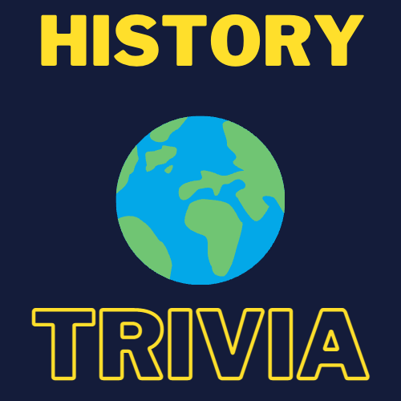
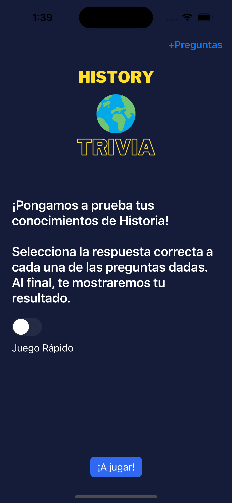
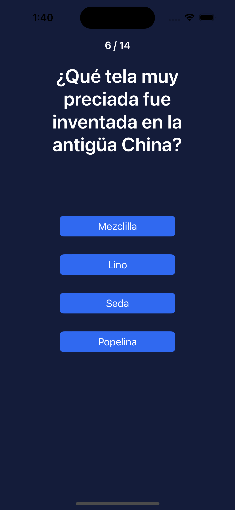
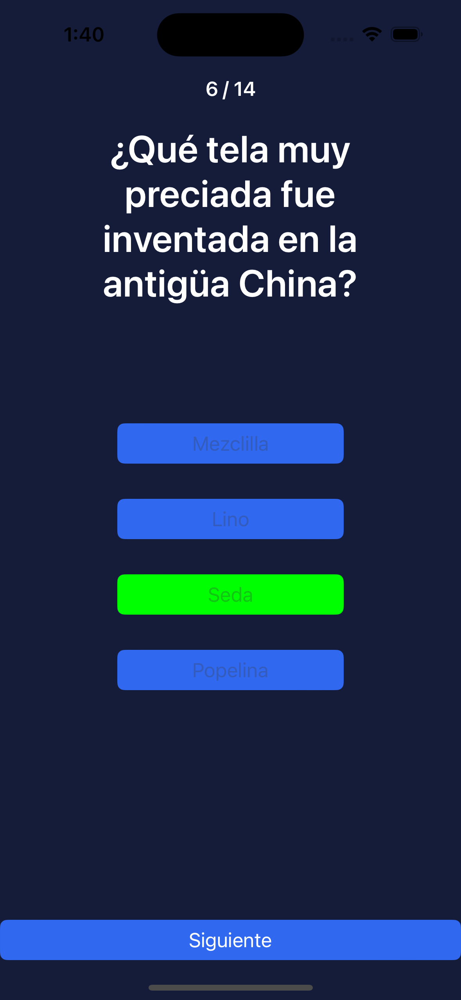
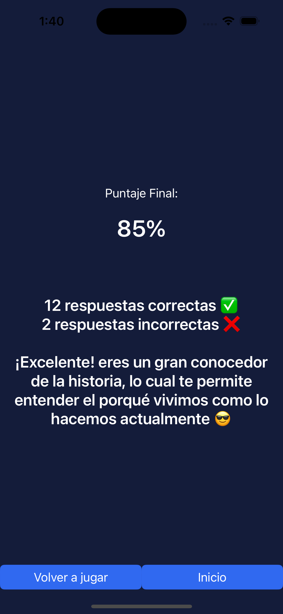
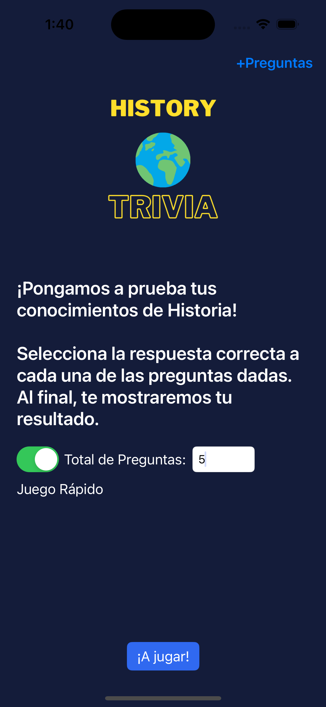
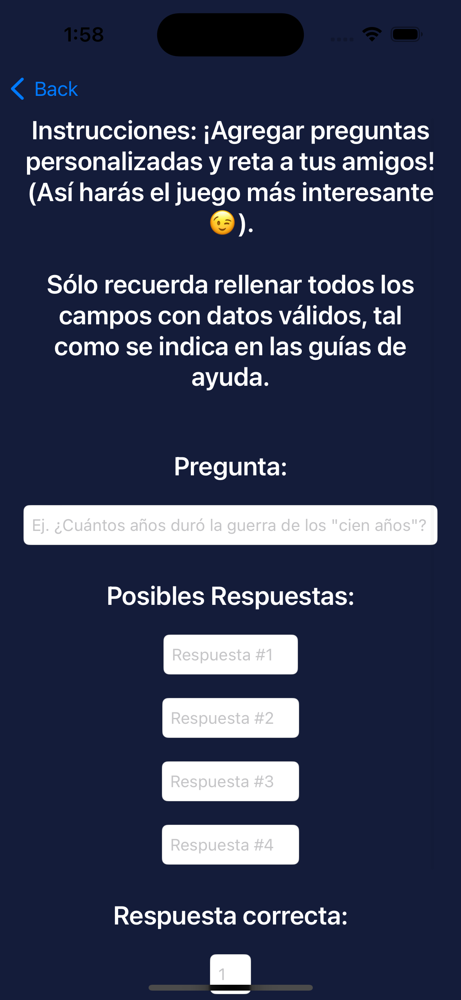
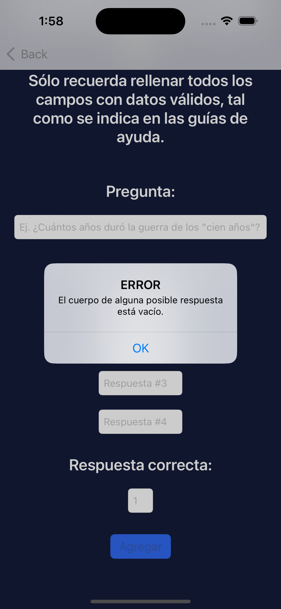

# History Trivia
*Por: Brian Jiménez Moedano*

*Febrero 2023*

## Descripción

**History Trivia** ha sido uno de mis primeros proyectos como *desarrollador iOS* con tan solo **2 meses** de estudio en el tema. Mi principal **motivación** al crearlo fue maduarar mis *conocimientos* y *habilidades* como desarrollador iOS a través de la **implementación** o práctica. Si bien la idea original no es mía, sino que formó parte del temario de estudio del curso *iOS Developer* de la plataforma de aprendizaje en línea **Codecademy**, implementé funcionalidades y características propias que la hacen parte de mi portafolio personal de aplicaciones.

## Características

- **Juego de Trivia** con temática histórica.
- Diseño de arquitectura **MVVM**.
- Tiene **10 preguntas precargadas** por defecto.
- Permite agregar **preguntas personalizadas**.
- Persistencia de datos locales con **Core Data** para las preguntas personalizadas.
- Dos modos de juego disponibles.
- **Juego Completo**: Usa todas las preguntas disponibles en la base de datos.
- **Juego Rápido**: Usa el número de preguntas especificadas por el jugador.
- Cada ronda carga las preguntas de manera aleatoria.
- Implementa patrones de diseño **Observable** y **Singleton**.

## Cómo Utilizarla

Al abrir la aplicación, se presentarán tres opciones al usuario:

1. **¡A Jugar!:** Presionar este botón inicia el juego en **modo completo**, es decir, se utilizarán las **10 preguntas cargadas por defecto** en la aplicación, más todas las **preguntas personalizadas** que se hayan agregado, y las presentará al usuario para que este elija la respuesta que crea correcta de un menú de **cuatro opciones/botones** disponibles.

    El juego avanzará conforme el usuario vaya seleccionando una respuesta a cada pregunta dada y posteriormente pique el botón **siguiente**.

    
El usuario sabrá si eligió la respuesta **correcta**, con un indicador de color **verde** en el botón de la respuesta seleccionada; de la misma manera, sabrá si eligió la respuetsa **incorrecta** con un indicador de color **rojo**.

    
Al contestar la pregunta final, se mostrará al usuario la **pantalla de puntaje final** en donde se despliega un resumen con los aciertos y errores, así como también dos opciones: **vovler a jugar** (con la configuración del juego actual), o **regresar al inicio**.

2. **Juego Rápido:** Es un switch que le permite al usuario jugar una **partida rápida con el número de preguntas que se especifique** en el campo que se destapa; cabe señalar que este último indica el **número máximo de preguntas disponibles**.

3. **+Preguntas:** Desde esta pantalla, el usuario podrá agregar **nuevas preguntas a la base de datos de la aplicación**, rellenando con información válida cada uno de los campos necesarios, los cuales integran una guía que indican como llenarse correctamente.

Cada vez que el usuario presione el botón de **agregar**, aparecerá una alerta indicando si hay algún error en los campos llenados, o si estos fueron rellenados correctamente y la pregunta se agregó correctamente a la base de datos.

## Tecnologías/Frameworks

- **UIKit:** Para el diseño de la interfaz de usuario.
- **Combine:** Para la observabilidad de objetos como parte de un patrón de diseño Observable.
- **CoreData:** Para la persistencia de datos en las preguntas personalizadas.

## Colaboradores

 - **Codecademy:** La idea original del proyecto es parte de su temario de estudio dentro del curso *iOS Developer Career Path.*

## Licenciamiento

- **GNU GPLv3**
